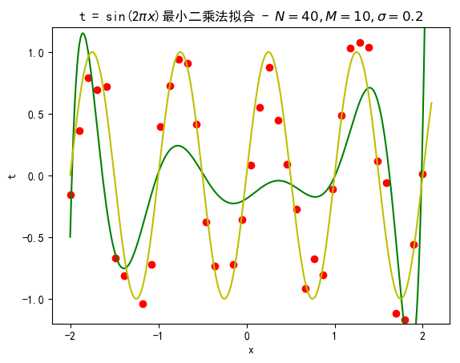
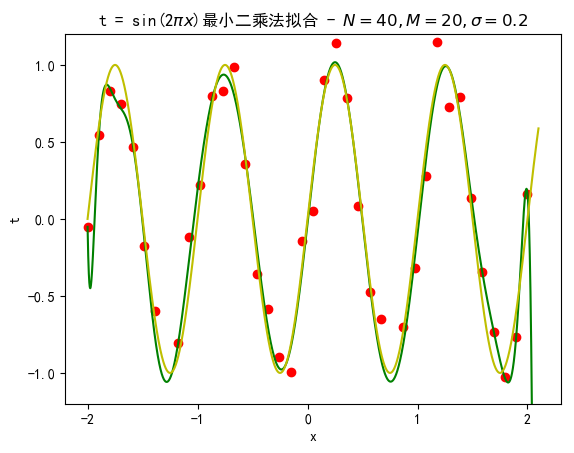
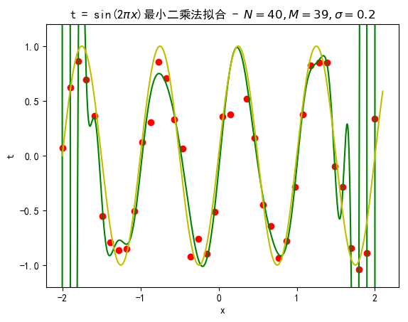
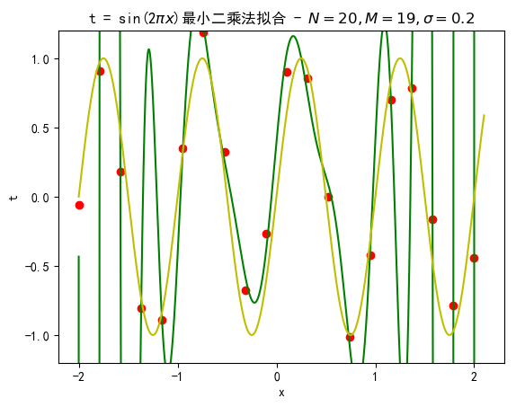
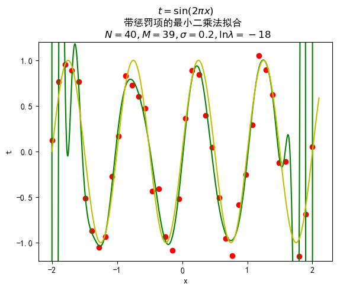
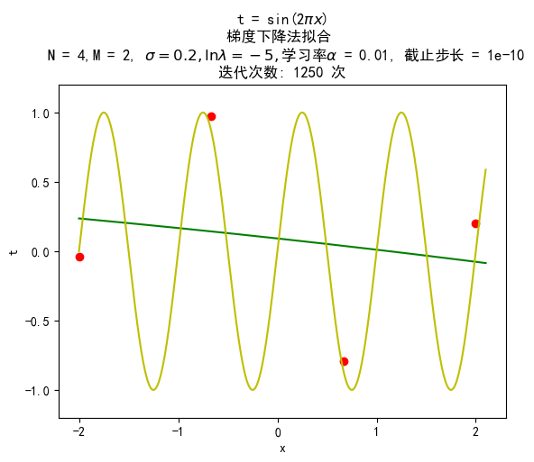
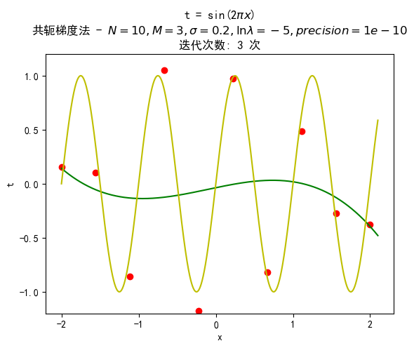
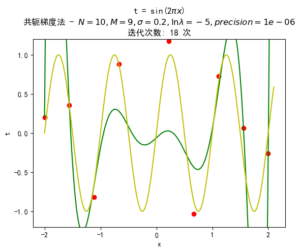

# <center>机器学习实验报告一——多项式拟合正弦函数</center>

李一鸣

2018 年 9 月 25 日

https://upupming.site/Lab1-polynomial-curve-fitting/README.html

- [<center>机器学习实验报告一——多项式拟合正弦函数</center>](#center%E6%9C%BA%E5%99%A8%E5%AD%A6%E4%B9%A0%E5%AE%9E%E9%AA%8C%E6%8A%A5%E5%91%8A%E4%B8%80%E5%A4%9A%E9%A1%B9%E5%BC%8F%E6%8B%9F%E5%90%88%E6%AD%A3%E5%BC%A6%E5%87%BD%E6%95%B0center)
- [多项式拟合正弦函数](#%E5%A4%9A%E9%A1%B9%E5%BC%8F%E6%8B%9F%E5%90%88%E6%AD%A3%E5%BC%A6%E5%87%BD%E6%95%B0)
  - [〇、数学符号格式规范](#%E3%80%87%E6%95%B0%E5%AD%A6%E7%AC%A6%E5%8F%B7%E6%A0%BC%E5%BC%8F%E8%A7%84%E8%8C%83)
  - [一、实验目的](#%E4%B8%80%E5%AE%9E%E9%AA%8C%E7%9B%AE%E7%9A%84)
  - [二、实验要求及实验环境](#%E4%BA%8C%E5%AE%9E%E9%AA%8C%E8%A6%81%E6%B1%82%E5%8F%8A%E5%AE%9E%E9%AA%8C%E7%8E%AF%E5%A2%83)
    - [实验要求](#%E5%AE%9E%E9%AA%8C%E8%A6%81%E6%B1%82)
    - [实验环境](#%E5%AE%9E%E9%AA%8C%E7%8E%AF%E5%A2%83)
      - [硬件](#%E7%A1%AC%E4%BB%B6)
      - [软件](#%E8%BD%AF%E4%BB%B6)
  - [三、设计思想](#%E4%B8%89%E8%AE%BE%E8%AE%A1%E6%80%9D%E6%83%B3)
    - [算法原理](#%E7%AE%97%E6%B3%95%E5%8E%9F%E7%90%86)
      - [生成数据](#%E7%94%9F%E6%88%90%E6%95%B0%E6%8D%AE)
      - [最小二乘法](#%E6%9C%80%E5%B0%8F%E4%BA%8C%E4%B9%98%E6%B3%95)
        - [误差函数 $E(\mathrm{\mathbf{w}})$](#%E8%AF%AF%E5%B7%AE%E5%87%BD%E6%95%B0-emathrmmathbfw)
        - [最小化误差函数求得最优解 $\mathrm{\mathbf{w_{ML}}}$](#%E6%9C%80%E5%B0%8F%E5%8C%96%E8%AF%AF%E5%B7%AE%E5%87%BD%E6%95%B0%E6%B1%82%E5%BE%97%E6%9C%80%E4%BC%98%E8%A7%A3-mathrmmathbfwml)
      - [带惩罚项的最小二乘法](#%E5%B8%A6%E6%83%A9%E7%BD%9A%E9%A1%B9%E7%9A%84%E6%9C%80%E5%B0%8F%E4%BA%8C%E4%B9%98%E6%B3%95)
      - [梯度下降法](#%E6%A2%AF%E5%BA%A6%E4%B8%8B%E9%99%8D%E6%B3%95)
      - [共轭梯度法](#%E5%85%B1%E8%BD%AD%E6%A2%AF%E5%BA%A6%E6%B3%95)
  - [三、实验结果与分析](#%E4%B8%89%E5%AE%9E%E9%AA%8C%E7%BB%93%E6%9E%9C%E4%B8%8E%E5%88%86%E6%9E%90)
    - [最小二乘法](#%E6%9C%80%E5%B0%8F%E4%BA%8C%E4%B9%98%E6%B3%95)
      - [N = 40, M = 10](#n--40-m--10)
      - [N = 40, M = 20](#n--40-m--20)
      - [N = 40, M = 39](#n--40-m--39)
      - [N = 20, M = 19](#n--20-m--19)
    - [带惩罚项的最小二乘法](#%E5%B8%A6%E6%83%A9%E7%BD%9A%E9%A1%B9%E7%9A%84%E6%9C%80%E5%B0%8F%E4%BA%8C%E4%B9%98%E6%B3%95)
      - [N = 40, M = 10](#n--40-m--10)
      - [N = 40, M = 20](#n--40-m--20)
      - [N = 40, M = 39](#n--40-m--39)
      - [N = 20, M = 19](#n--20-m--19)
    - [梯度下降法](#%E6%A2%AF%E5%BA%A6%E4%B8%8B%E9%99%8D%E6%B3%95)
      - [N = 4, M = 2](#n--4-m--2)
      - [N = 10, M = 3](#n--10-m--3)
      - [N = 10, M = 9](#n--10-m--9)
    - [共轭梯度法](#%E5%85%B1%E8%BD%AD%E6%A2%AF%E5%BA%A6%E6%B3%95)
      - [N = 4, M = 2](#n--4-m--2)
      - [N = 10, M = 3](#n--10-m--3)
      - [N = 10, M = 9](#n--10-m--9)
  - [四、结论](#%E5%9B%9B%E7%BB%93%E8%AE%BA)
  - [五、参考文献](#%E4%BA%94%E5%8F%82%E8%80%83%E6%96%87%E7%8C%AE)
  - [七、附录：源代码（带注释）](#%E4%B8%83%E9%99%84%E5%BD%95%E6%BA%90%E4%BB%A3%E7%A0%81%E5%B8%A6%E6%B3%A8%E9%87%8A)
    - [`data_generator.py`](#datageneratorpy)
    - [`least_squares.py`](#leastsquarespy)
    - [`least_squares_regularization.py`](#leastsquaresregularizationpy)
    - [`gradient_descent.py`](#gradientdescentpy)
    - [`conjugate_gradient.py`](#conjugategradientpy)

# 多项式拟合正弦函数

|班号|学号|姓名|
|--|---|----|
|1603103|1160300625|李一鸣|


## 〇、数学符号格式规范

本文格式参考了 [Bishop 2006]，若不加特殊说明，定义向量时均是列向量。

|数据类型|格式规范|MathJax 写法|实际效果|
|-|-|-|-|
|向量|小写加粗罗马字母|`\mathrm{\mathbf{w}}`|$\mathrm{\mathbf{w}}$|
|转置|右上标 T|`(w_0, w_1, ..., w_M)^T`|$(w_0, w_1, ..., w_M)^T$|
|随机变量分布类型|书法字母 (calligraphic letters)|`\mathcal{N}`|$\mathcal{N}$|
|矩阵|大写加粗罗马字母|`\mathrm{\mathbf{X}}`|$\mathrm{\mathbf{X}}$|

## 一、实验目的

+ 掌握最小二乘法求解（无惩罚项的损失函数）
+ 掌握加惩罚项（2 范数）的损失函数优化
+ 梯度下降法、共轭梯度法
+ 理解过拟合、克服过拟合的方法(如加惩罚项、增加样本)

## 二、实验要求及实验环境

### 实验要求

+ [x] 生成数据，加入噪声
+ [x] 用高阶多项式函数拟合曲线
+ [x] 用解析解求解两种 loss 的最优解（无正则项和有正则项）
+ [x] 优化方法求解最优解（梯度下降，共轭梯度）
+ [x] 用你得到的实验数据，解释过拟合
+ [x] 用不同数据量，不同超参数，不同的多项式阶数，比较实验效果

<!-- 7. 语言不限，可以用 matlab，python。求解解析解时可以利用现成的矩阵求逆。梯度下降，共轭梯度要求自己求梯度，迭代优化自己写。不许用现成的平台，例如 pytorch，tensorflow 的自动微分工具。 -->

### 实验环境

#### 硬件

+ Windows 10 64-bit
+ Python 3.7.0

#### 软件

+ Matplotlib
  
  Python 2D 绘图库

+ NumPy
  
  矩阵运算

## 三、设计思想

本次实验的目标是对正弦函数曲线 $sin(2\pi x)$ 进行拟合。简单来讲，就是根据已有数据集 $(x_i, y_i)$ 找到一条曲线，使其能够最好地预测真实情况下给定 $x$ 后计算出的 $y$ 值。正弦函数只是一个具体的例子，理解了算法的思想之后，我们可以对任意曲线进行拟合。

### 算法原理

向量、矩阵均采用数据结构均是 Numpy 中提供的数组结构。

#### 生成数据

编写一个函数，根据用户传入的函数生成指定数量的数据，利用 Numpy 库提供的 `numpy.random.normal` 加入以 0 为均值、用户指定方差的噪声。以字典 `{'xArray': array, 'tArray': array}` 的形式返回给用户。

#### 最小二乘法

##### 误差函数 $E(\mathrm{\mathbf{w}})$

最小二乘法通过**最小化误差的平方和**寻找数据的最佳函数匹配。

我们使用下面的多项式函数来拟合数据:

$$
y(x, \mathrm{\mathbf{w}}) = w_0 + w_1x + w_2x^2 + ... + w_Mx^M = \sum_{j = 0}^Mw_jx^j
$$(1)

其中 $M$ 为多项式阶数，多项式系数向量 $\mathrm{\mathbf{w}} = (w_0, w_1, ..., w_M)^T$。

显然

$$
\begin{aligned}
  y(x, \mathrm{\mathbf{w}}) 
  &= 
    \begin{pmatrix}  
      1 & x & ... & x^M
    \end{pmatrix}
    \mathrm{\mathbf{w}}
\end{aligned}
$$(2)

其中 

为了求得最优的解析解，我们需要最小化 $N$ 个数据误差的平方和，也就是最小化下面的误差函数：

$$
E(\mathrm{\mathbf{w}}) = \frac{1}{2}\sum_{n = 1}^N\{y(x_n, \mathrm{\mathbf{w}}) - t_n\}^2
$$(3)

误差函数中的 $\frac{1}{2}$ 是利用高斯分布进行最大似然估计得来的。假定在 $x$ 已知的情况下，相应的 $t$ 服从以 $y(x, \mathrm{\mathbf{w}})$ 为均值、以 $\beta^{-1}$ 为方差的高斯分布，即：

$$
\begin{aligned}
  p(t|x, \mathrm{\mathbf{w}}, \beta)
  &= \mathcal{N}(t|y(x, \mathrm{\mathbf{w}}), \beta^{-1}) \\
  &= \frac{\exp{-\frac{[t - y(x, \mathrm{\mathbf{w}})]^2}{2\beta^{-1}}}}{(2\pi \beta^{-1})^{\frac{1}{2}}}
\end{aligned}
$$(4)

由于每个数据都是独立同分布的，根据乘法公式，对于训练数据集 $\mathrm{\mathbf{x}} = (x_1, x_2, ..., x_N)^T$ 和 $\mathrm{\mathbf{t}} = (t_1, t_2, ..., t_N)^T$ 则有：

$$
\begin{aligned}
  p(\mathrm{\mathbf{t}}|\mathrm{\mathbf{x}}, \mathrm{\mathbf{w}}, \beta) 
  &= \prod_{n = 1}^N\mathcal{N}(t_n|y(x_n, \mathrm{\mathbf{w}}), \beta^{-1}) \\
  &= \prod_{n = 1}^N\frac{\exp-{\frac{[y(x_n, \mathrm{\mathbf{w}}) - t_n )]^2}{2\beta^{-1}}}}{(2\pi \beta^{-1})^{\frac{1}{2}}}
\end{aligned}
$$(5)

这就是似然函数，即在 $\mathrm{\mathbf{w}}$ 已知的条件下，给定 $\mathrm{\mathbf{x}}$ 利用拟合曲线得到的估计值正好是 $\mathrm{\mathbf{t}}$ 的概率。我们的任务就是最大化似然函数，由于⼤量⼩概率的乘积很容易下溢，于是我们转而计算概率的对数和：

$$
\begin{aligned}
\ln p(\mathrm{\mathbf{t}}|\mathrm{\mathbf{x}}, \mathrm{\mathbf{w}}, \beta) 
&= \sum_{n = 1}^N\{-\frac{\beta}{2}[y(x_n, \mathrm{\mathbf{w}}) - t_n )]^2 - \frac{1}{2}\ln \frac{2\pi}{\beta}\}  \\
&= -\frac{\beta}{2}\sum_{n = 1}^N{[y(x_n, \mathrm{\mathbf{w}}) - t_n )]^2} + \frac{N}{2}\ln \beta - \frac{N}{2}\ln 2\pi
\end{aligned}
$$(6)

现假设系数向量 $\mathrm{\mathbf{w}}$ 取 $\mathrm{\mathbf{w_{ML}}}$ 时似然函数达到最大值。为了求解 $\mathrm{\mathbf{w_{ML}}}$，可以忽略后两项，同时将第一项中的 $-\frac{\beta}{2}$ 替换为 $\frac{1}{2}$ 也不会影响计算结果。也就是要最大化：

$$
-\frac{1}{2}\sum_{n = 1}^N{[y(x_n, \mathrm{\mathbf{w}}) - t_n )]^2}
$$(7)

这等价于最小化误差函数 (3)。

##### 最小化误差函数求得最优解 $\mathrm{\mathbf{w_{ML}}}$

下面对 (3) 做一些变形：

$$
\begin{aligned}
E(\mathrm{\mathbf{w}})
&= \frac{1}{2}\sum_{n = 1}^N{[y(x_n, \mathrm{\mathbf{w}}) - t_n )]^2} \\
&= \frac{1}{2}\left\|
\begin{pmatrix}
  1 & x_1 & x_1^2 & ... & x_1^M \\
  1 & x_2 & x_2^2 & ... & x_2^M \\
  ... & ... & ... & ... & ... \\
  1 & x_N & x_N^2 & ... & x_N^M \\
\end{pmatrix}_{N\times (M+1)}
\mathrm{\mathbf{w}}_{(M+1) \times 1} - \mathrm{\mathbf{t}_{N \times 1}}
\right\|^2
\end{aligned}
$$

令
$$
\mathrm{\mathbf{X}} = \begin{pmatrix}
  1 & x_1 & x_1^2 & ... & x_1^M \\
  1 & x_2 & x_2^2 & ... & x_2^M \\
  ... & ... & ... & ... & ... \\
  1 & x_N & x_N^2 & ... & x_N^M \\
\end{pmatrix}_{N\times (M+1)}
$$(8)

则

$$
\begin{aligned}
E(\mathrm{\mathbf{w}})
&= \frac{1}{2}\left\|
\mathrm{\mathbf{X}}\mathrm{\mathbf{w}} - \mathrm{\mathbf{t}}
\right\|^2 \\
&= \frac{1}{2}(\mathrm{\mathbf{X}}\mathrm{\mathbf{w}} - \mathrm{\mathbf{t}})^T(\mathrm{\mathbf{X}}\mathrm{\mathbf{w}} - \mathrm{\mathbf{t}}) \\
&= \frac{1}{2}(\mathrm{\mathbf{w}}^T\mathrm{\mathbf{X}}^T\mathrm{\mathbf{X}}\mathrm{\mathbf{w}} - \mathrm{\mathbf{w}}^T\mathrm{\mathbf{X}}^T\mathrm{\mathbf{t}} - \mathrm{\mathbf{t}}^T\mathrm{\mathbf{X}}\mathrm{\mathbf{w}} + \mathrm{\mathbf{t}}^T\mathrm{\mathbf{t}})
\end{aligned}
$$(9)

接下来我们需要求导，在下面的计算过程中要十分注意矩阵求导是该采用分子布局还是分母布局，下面引用一段 [Matrix calculus | Wikipedia] 中的原话：

> 1. If we choose numerator layout for $\frac {\partial \mathbf {y} }{\partial \mathbf {x} }$, we should lay out the gradient $\frac {\partial y}{\partial \mathbf {x} }$ as a row vector, and $\frac {\partial \mathbf {y} }{\partial x}$ as a column vector.
> 2. If we choose denominator layout for $\frac {\partial \mathbf {y} }{\partial \mathbf {x} }$, we should lay out the gradient $\frac {\partial y}{\partial \mathbf {x} }$ as a column vector, and $\frac {\partial \mathbf {y}}{\partial x}$ as a row vector.
> 3. In the third possibility above, we write $\frac {\partial y}{\partial \mathbf {x} '}$ and $\frac {\partial \mathbf {y} }{\partial x}$, and use numerator layout.

我们在接下来的计算中选择第 1 种规约 (Consistent numerator layout)，$\frac {\partial \mathbf {y} }{\partial x}$ 以 $\mathbf{y}$ 布局，$\frac{\partial y}{\partial \mathbf{x}}$ 以 $\mathbf{x}^T$ 布局，那么就有

$$
\begin{aligned}
  \frac{\partial\mathrm{\mathbf{w}}^T\mathrm{\mathbf{A}}\mathrm{\mathbf{w}}}{\partial\mathrm{\mathbf{w}}} = \mathrm{\mathbf{w}}^T\mathrm{\mathbf{A}} + \mathrm{\mathbf{w}}^T\mathrm{\mathbf{A}}^T  \\ \\
  \frac{\partial\mathrm{\mathbf{w}}^T\mathrm{\mathbf{A}}}{\mathrm{\mathbf{w}}} = \frac{\partial\mathrm{\mathbf{w}}\mathrm{\mathbf{A}^T}}{\mathrm{\mathbf{w}}} = \mathrm{\mathbf{A}}^T
\end{aligned}
$$(10)

对 $\mathrm{\mathbf{w}}$ 求导，得：

$$
\begin{aligned}
  \frac{\partial E(\mathrm{\mathbf{w}})}{\partial \mathrm{\mathbf{w}}}
  &= \frac{\partial \frac{1}{2}(\mathrm{\mathbf{w}}^T\mathrm{\mathbf{X}}^T\mathrm{\mathbf{X}}\mathrm{\mathbf{w}} - \mathrm{\mathbf{w}}^T\mathrm{\mathbf{X}}^T\mathrm{\mathbf{t}} - \mathrm{\mathbf{t}}^T\mathrm{\mathbf{X}}\mathrm{\mathbf{w}} + \mathrm{\mathbf{t}}^T\mathrm{\mathbf{t}})}{\partial \mathrm{\mathbf{w}}} \\
  &= \frac{1}{2}(2\mathrm{\mathbf{w}}^T\mathrm{\mathbf{X}}^T\mathrm{\mathbf{X}} - 2\mathrm{\mathbf{t}}^T\mathrm{\mathbf{X}}) \\
  &= \mathrm{\mathbf{w}}^T\mathrm{\mathbf{X}}^T\mathrm{\mathbf{X}} - \mathrm{\mathbf{t}}^T\mathrm{\mathbf{X}}
\end{aligned}
$$(11)

令导数为 $0$ 解得：

$$
\mathrm{\mathbf{w_{ML}}} = (\mathrm{\mathbf{X}}^{T}\mathrm{\mathbf{X}})^{-1}(\mathrm{\mathbf{X}}^{T}\mathrm{\mathbf{t}})
$$(12)

总结：对于已知训练数据集 $\mathrm{\mathbf{x}}、\mathrm{\mathbf{t}}$，规定一个多项式次数 $M$，根据相应的范德蒙德矩阵 (8) 以及式 (12) 就可以解出最优解 $\mathrm{\mathbf{w_{ML}}}$。再根据 (2) 即可计算估计值从而获得拟合曲线。

然而，当多项式次数 $M$ 刚好等于 $N-1$ 时，能够使训练数据集的误差函数取值为 0（例：2 次函数可以完全拟合 3 个点），但对测试数据集却不能很好地拟合，这就是**过拟合**。经过查阅资料，主要有这几种解决方法：

1. 增大数据量
2. 使用贝叶斯方法，根据数据集的规模自动调节有效参数数量
3. 修正误差函数，加入惩罚项，对其进行正则化 (regularization)

下面讨论加入惩罚项的最小二乘法。

#### 带惩罚项的最小二乘法

修正误差函数，在 (3) 式的基础上加入正则项：

$$
\begin{aligned}
\widetilde{E}(\mathrm{\mathbf{w}})
  &= \frac{1}{2}\sum_{n = 1}^N\{y(x_n, \mathrm{\mathbf{w}}) - t_n\}^2 + \frac{\lambda}{2}\|\mathrm{\mathbf{w}}\|^2 \\
  &= \frac{1}{2}(\mathrm{\mathbf{w}}^T\mathrm{\mathbf{X}}^T\mathrm{\mathbf{X}}\mathrm{\mathbf{w}} - \mathrm{\mathbf{w}}^T\mathrm{\mathbf{X}}^T\mathrm{\mathbf{t}} - \mathrm{\mathbf{t}}^T\mathrm{\mathbf{X}}\mathrm{\mathbf{w}} + \mathrm{\mathbf{t}}^T\mathrm{\mathbf{t}}) + \frac{\lambda}{2}(\mathrm{\mathbf{w}}^T\mathrm{\mathbf{w}})
\end{aligned}
$$(13)

其中 $\lambda$ 调节正则项、平方和两者之间的比例。

将其对 $\mathrm{\mathbf{w}}$：

$$
\begin{aligned}
\frac{\partial\widetilde{E}(\mathrm{\mathbf{w}})}{\partial\mathrm{\mathbf{w}}}
  &= \mathrm{\mathbf{w}}^T\mathrm{\mathbf{X}}^T\mathrm{\mathbf{X}} - \mathrm{\mathbf{t}}^T\mathrm{\mathbf{X}} + \frac{\lambda}{2}\frac{\partial(\mathrm{\mathbf{w}}^T\mathrm{\mathbf{w}})}{\partial \mathrm{\mathbf{w}}}
\end{aligned}
$$

这里同样需要用到 [Matrix calculus | Wikipedia] 中的矩阵求导的一个 (scalar-by-vector) 公式：

$$
\frac{\partial(\mathrm{\mathbf{w}}^T\mathrm{\mathbf{w}})}{\partial \mathrm{\mathbf{w}}} = 2\mathrm{\mathbf{w}}^T
$$(14)

于是得到：

$$
\begin{aligned}
\frac{\partial\widetilde{E}(\mathrm{\mathbf{w}})}{\partial\mathrm{\mathbf{w}}} = \mathrm{\mathbf{w}}^T\mathrm{\mathbf{X}}^T\mathrm{\mathbf{X}} - \mathrm{\mathbf{t}}^T\mathrm{\mathbf{X}} + \lambda\mathrm{\mathbf{w}}^T
\end{aligned}
$$(15)

令导数为 $0$，解得：

$$
\mathrm{\mathbf{w_{ML}}} = (\mathrm{\mathbf{X}}^{T}\mathrm{\mathbf{X}} + \lambda\mathrm{\mathbf{I}}_{(M+1)(M+1)})^{-1}(\mathrm{\mathbf{X}}^{T}\mathrm{\mathbf{t}})
$$(16)

总结：带惩罚项的最小二乘法解析解与普通最小二乘法相比，相差不大，只是在左边乘积项中多了一个单位矩阵的 $\lambda$ 倍。

#### 梯度下降法

说到梯度下降法，我们可以先来看看**导数下降法**。对于下面的函数 $f$：


<div style="margin-top:60px">

我们可以用这种方法求解 $f(x) = 0$ 的解：
    
  1. 初始化 $x = 0$ （任意值都可以），给定精确度 $\alpha = 0.2$
  2. $f'(0) < 0$，令 $x = x + \alpha = 0.2$
  3. $f'(0.2) < 0$，令 $x = x + \alpha = 0.4$
  4. $f'(0.4) > 0$，令 $x = x + \alpha = 0.6$
  5. $f'(0.6) > 0$，令 $x = x - \alpha = 0.4$
</div>

<div style="clear:both">

可以看到，按照这个计算过程 $x$ 会一直在 $0.4$ 和 $0.6$ 两个数之间变化。实际计算时应该减去导数值与 $\alpha$（学习率）的乘积，如果我们将 $\alpha$ 取的足够小，并让这个迭代过程在可接受的误差范围内停止的话，我们最终将得到方程的解。当然，$\alpha$ 也不宜太小，否则会导致误差下降缓慢，计算耗时太长。

</div>

**梯度下降法**则是对向量函数进行类似的处理。梯度的方向是函数上升最快的方向，其反方向则是函数下降最快的方向。我们的目的就是找到误差函数 $\widetilde{E}(\mathrm{\mathbf{w}})$ 取最小值的点，我们可以从任意点开始沿着其梯度反方向以学习率为步长进行迭代，最终在误差许可范围内停止。

对误差函数 $\widetilde{E}(\mathrm{\mathbf{w}})$ 求梯度得：

$$
\begin{aligned}
  \nabla \widetilde{E}(\mathrm{\mathbf{w}}) 
  &= \nabla [\frac{1}{2}\left\|
\mathrm{\mathbf{X}}\mathrm{\mathbf{w}} - \mathrm{\mathbf{t}}
\right\|^2 + \frac{\lambda}{2}(\mathrm{\mathbf{w}}^T\mathrm{\mathbf{w}})] \\
  &= \mathrm{\mathbf{X}}^T(\mathrm{\mathbf{X}}\mathrm{\mathbf{w}} - \mathrm{\mathbf{t}}) + \lambda \mathrm{\mathbf{w}}
\end{aligned}
$$(17)


#### 共轭梯度法

共轭梯度法是求解系数矩阵为对称正定矩阵的线性方程组的数值解的方法。共轭梯度法是一个迭代方法，它适用于系数矩阵为稀疏矩阵的线性方程组，因为使用像 Cholesky 分解这样的直接方法求解这些系统所需的计算量太大了。这种方程组在数值求解偏微分方程时很常见。<sup>[Conjugate gradient method | Wikipedia]</sup>

现有正定对称矩阵 $\mathrm{\mathbf{A}}$，如果

$$
\mathrm{\mathbf{u}}^T\mathrm{\mathbf{A}}\mathrm{\mathbf{v}} = 0
$$(18)

成立，则称 $\mathrm{\mathbf{u}}$、$\mathrm{\mathbf{v}}$ 关于 $\mathrm{\mathbf{A}}$ 共轭,此时上式可用 $\langle\mathrm{\mathbf{u}}, \mathrm{\mathbf{v}}\rangle_\mathrm{\mathbf{A}}$ 表示。

在上文中我们看到的 $\mathrm{\mathbf{X}}^T\mathrm{\mathbf{X}}$ 显然是满足正定且对称这个条件的，因为：

$$
\mathrm{\mathbf{P}}^T\mathrm{\mathbf{X}}^T\mathrm{\mathbf{X}}\mathrm{\mathbf{P}} = \left\|\mathrm{\mathbf{X}}\mathrm{\mathbf{P}}\right\|^2 > 0
$$(正定性)

$$
(\mathrm{\mathbf{X}}^T\mathrm{\mathbf{X}})^T = \mathrm{\mathbf{X}}^T\mathrm{\mathbf{X}}
$$(对称性)

由式 (15) 在 $\mathrm{\mathbf{w}} = \mathrm{\mathbf{w_{ML}}}$ 时为 0 可得：

$$
\begin{aligned}
  (\mathrm{\mathbf{X}}^T\mathrm{\mathbf{X}} + \lambda \mathrm{\mathbf{I}}_{(M+1)\times(M+1)})\mathrm{\mathbf{w_{ML}}} &= \mathrm{\mathbf{X}}^T\mathrm{\mathbf{t}} \\
  \mathrm{\mathbf{B}}\mathrm{\mathbf{w_{ML}}} &= \mathrm{\mathbf{X}}^T\mathrm{\mathbf{t}}
\end{aligned}
$$(19)

其中

$$\mathrm{\mathbf{B}} = \mathrm{\mathbf{X}}^T\mathrm{\mathbf{X}} + \lambda \mathrm{\mathbf{I}}_{(M+1)\times(M+1)}$$(20)

显然 $\mathrm{\mathbf{B}}$ 也是正定、对称的。


定义矩阵 $\mathrm{\mathbf{P}} = (\mathrm{\mathbf{p_1}}, \mathrm{\mathbf{p_2}}, ...,  \mathrm{\mathbf{p_{M+1}}})$，其中的每一个向量都是关于 $\mathrm{\mathbf{B}}$ 共轭的，并且构成了一组基底，任何向量都可以由它们组合产生。先假设我们要求的 $\mathrm{\mathbf{w_{ML}}}$ 为：

$$
\mathrm{\mathbf{w_{ML}}} = \sum_{i=1}^{M+1} \alpha _i \mathrm{\mathbf{p_i}}
$$(21)

两边同乘 $\mathrm{\mathbf{B}}$ 有：

$$
\mathrm{\mathbf{B}}\mathrm{\mathbf{w_{ML}}} = \sum_{i=1}^{M+1} \alpha _i \mathrm{\mathbf{B}}\mathrm{\mathbf{p_i}}
$$(22)

再在两边同乘 $\mathrm{\mathbf{p_k}}^T$，有：

$$
\mathrm{\mathbf{p_k}}^T\mathrm{\mathbf{B}}\mathrm{\mathbf{w_{ML}}} = \sum_{i=1}^{M+1} \alpha _i \mathrm{\mathbf{p_k}}^T\mathrm{\mathbf{B}}\mathrm{\mathbf{p_i}}
$$(23)

由式 (19) 我们知道 $\mathrm{\mathbf{B}}\mathrm{\mathbf{w_{ML}}} = \mathrm{\mathbf{X}}^T\mathrm{\mathbf{t}}$，从而：

$$
\mathrm{\mathbf{p_k}}^T\mathrm{\mathbf{X}}^T\mathrm{\mathbf{t}} = \sum_{i=1}^{M+1} \alpha _i \langle\mathrm{\mathbf{p_k}}, \mathrm{\mathbf{p_i}}\rangle_\mathrm{\mathbf{B}}
$$(24)

用 $\langle \mathrm{\mathbf{u}}, \mathrm{\mathbf{v}}\rangle$ 表示 $\mathrm{\mathbf{u}}^T\mathrm{\mathbf{v}}$，同时使用共轭的已知条件 $\forall i \neq k: \langle \mathrm{\mathbf{p_k}}, \mathrm{\mathbf{p_i}} \rangle_\mathrm{\mathbf{B}} = 0$，可以得到：

$$
\langle \mathrm{\mathbf{p_k}}, \mathrm{\mathbf{X}}^T\mathrm{\mathbf{t}}\rangle = \alpha _k \langle\mathrm{\mathbf{p_k}}, \mathrm{\mathbf{p_k}}\rangle_\mathrm{\mathbf{B}}
$$(25)

从而解得：

$$
\alpha _k = \frac{\langle \mathrm{\mathbf{p_k}}, \mathrm{\mathbf{X}}^T\mathrm{\mathbf{t}}\rangle}{\langle\mathrm{\mathbf{p_k}}, \mathrm{\mathbf{p_k}}\rangle_\mathrm{\mathbf{B}}}
$$(26)

总结：利用共轭梯度法我们可以从 $\mathrm{\mathbf{p_0}}$ 开始逐渐向初始点的共轭方向逼近，加快求解效率。最优解由式 (20)、式 (21)、式 (26) 给出。

## 三、实验结果与分析

### 最小二乘法

运行命令：

```
$ make least_squares
```

#### N = 40, M = 10



$\mathrm{\mathbf{w_{ML}}} =$

<object width="100%" height="100px" data="./training_results/least-squares-40-10.txt"></object>


拟合效果不太好，很多点相距曲线较远。同时相对正弦函数有一些误差。

#### N = 40, M = 20



$\mathrm{\mathbf{w_{ML}}} =$
<object width="100%" height="180px" data="./training_results/least-squares-40-20.txt"></object>


对训练数据拟合度比较高，同时拟合曲线比较符合正弦曲线的轨迹。

#### N = 40, M = 39



$\mathrm{\mathbf{w_{ML}}} =$

<object width="100%" height="240px" data="./training_results/least-squares-40-39.txt"></object>

可以看到几乎所有点都被拟合了，但是图像与正弦函数相比有较大的误差，有些地方曲线波动非常大。这就是**过拟合**现象。

#### N = 20, M = 19



$\mathrm{\mathbf{w_{ML}}} =$

<object width="100%" height="180px" data="./training_results/least-squares-20-19.txt"></object>

跟上一种情况类似，几乎所有点都被拟合了，但是图像与正弦函数相比有较大的误差，有许多波动大的地方。同样出现了过拟合现象。

### 带惩罚项的最小二乘法

运行命令：

```
$ make least_squares_regularization
```

#### N = 40, M = 10


$\mathrm{\mathbf{w_{ML}}} =$

<object width="100%" height="100px" data="./training_results/least-squares-regularization-40-10.txt"></object>

对训练数据的拟合效果较差，同时相比于正弦函数误差较大，需要增加多项式系数来更好地拟合。

#### N = 40, M = 20


$\mathrm{\mathbf{w_{ML}}} =$

<object width="100%" height="160px" data="./training_results/least-squares-regularization-40-20.txt"></object>

拟合效果比较好，有一些点都没有落在拟合曲线上。拟合曲线比较符合正弦的轨迹。

#### N = 40, M = 39



$\mathrm{\mathbf{w_{ML}}} =$

<object width="100%" height="240px" data="./training_results/least-squares-regularization-40-39.txt"></object>

拟合效果比较好，有一些点都没有落在拟合曲线上。拟合曲线也比较符合正弦的轨迹，但不如 $M = 20$ 时，可以考虑增大 $\lambda$。

#### N = 20, M = 19


$\mathrm{\mathbf{w_{ML}}} =$

<object width="100%" height="140px" data="./training_results/least-squares-regularization-20-19.txt"></object>

拟合效果很好，基本都落在拟合曲线上。拟合曲线有些许波动，不过比不加正则项要好许多。可以考虑进一步增大 $\lambda$ 来降低误差。

### 梯度下降法

通过实验，我可算是理解到了梯度下降的本质：不断地调节学习率，既不能太大以确保收敛，又不能太小让计算机能在有效时间内给出结果。

#### N = 4, M = 2



$\mathrm{\mathbf{w_{ML}}} =$

<object width="100%" height="80px" data="./training_results/gradient-descent-4-2.txt"></object>

因为数据点比较少，拟合效果一般，也不太符合正弦曲线的特征。

#### N = 10, M = 3


$\mathrm{\mathbf{w_{ML}}} =$

<object width="100%" height="80px" data="./training_results/gradient-descent-10-3.txt"></object>

拟合效果不太好，也不太符合正弦曲线的特征。

#### N = 10, M = 9


$\mathrm{\mathbf{w_{ML}}} =$

<object width="100%" height="100px" data="./training_results/gradient-descent-10-9.txt"></object>

拟合效果比较好，同时曲线较好地吻合了正弦曲线。

### 共轭梯度法

共轭梯度法在实际求解中是对 $\mathrm{\mathbf{w}}$ 不断进行迭代的，算法描述如下：

$\begin{aligned}
&\mathrm{\mathbf{B}} = \mathrm{\mathbf{X}^T}\mathrm{\mathbf{X}} + \lambda \mathrm{\mathbf{I}_{(M+1)\times(M+1)}} \\&
\mathrm{\mathbf{w_0}} = \mathrm{\mathbf{0}} \\&
\mathrm{\mathbf{r_0}} = \mathrm{\mathbf{X}}^T\mathrm{\mathbf{t}} - \mathrm{\mathbf{B}}\mathrm{\mathbf{w_0}} \\&
\mathrm{\mathbf{p_0}} = \mathrm{\mathbf{r_0}} \\&
k = 0 \\ \\&
while True: \\&
\qquad \alpha _k = \frac{\mathrm{\mathbf{r_k}^T}\mathrm{\mathbf{r_k}}}{\mathrm{\mathbf{p_k}}^T\mathrm{\mathbf{B}}\mathrm{\mathbf{p_k}}} \\&
\qquad \mathrm{\mathbf{w_{k+1}}} = \mathrm{\mathbf{w_k}} + \alpha _k\mathrm{\mathbf{p _k}} \\&
\qquad \mathrm{\mathbf{r_{k+1}}} = \mathrm{\mathbf{r_k}} - \alpha _k\mathrm{\mathbf{B}}\mathrm{\mathbf{p _k}} \\&
\qquad 如果 \mathrm{\mathbf{r_{k+1}}} 足够小，停止迭代 \\&
\qquad \beta _k = \frac{\mathrm{\mathbf{r_{k+1}}^T}\mathrm{\mathbf{r_{k+1}}}}{\mathrm{\mathbf{r_k}^T}\mathrm{\mathbf{r_k}}} \\&
\qquad \mathrm{\mathbf{p_{k+1}}} = \mathrm{\mathbf{r_{k+1}}} + \beta _k\mathrm{\mathbf{p _k}} \\&
\qquad  k = k + 1 \\ \\&
输出结果 \qquad \mathrm{\mathbf{w_{k+1}}}
\end{aligned}$

实际运行时发现相对于梯度下降法，迭代次数少了许多，速度明显增加。

#### N = 4, M = 2


$\mathrm{\mathbf{w_{ML}}} =$

<object width="100%" height="80px" data="./training_results/conjugate-gradient-4-2.txt"></object>

拟合效果不太好，也不太符合正弦曲线的特征。与梯度下降法的误差相差不大。

#### N = 10, M = 3



$\mathrm{\mathbf{w_{ML}}} =$

<object width="100%" height="80px" data="./training_results/conjugate-gradient-10-3.txt"></object>

同样拟合效果不太好，也不太符合正弦曲线的特征。与梯度下降法的误差相差不大。

#### N = 10, M = 9



$\mathrm{\mathbf{w_{ML}}} =$

<object width="100%" height="80px" data="./training_results/conjugate-gradient-10-9.txt"></object>

拟合效果很好好，符合正弦曲线的特征。与梯度下降法的误差相差不大。

## 四、结论

1. 最小二乘法需要计算矩阵的逆效率较慢。
2. 最小二乘法中多项式阶数 $M$ 越大，拟合效果越好，但可能会出现过拟合现象，主要的解决办法有：
    + 增加数据数量
    + 采用贝叶斯方法自动调节有效参数数量
    + 加入惩罚项 :heavy_check_mark:
3. 梯度下降法避免了矩阵求逆过程，不过梯度的选取需要反复测试。当学习率较小的时候，运行的时候速度与最小二乘法相比慢得多；当学习率较大的时候，又可能出现不收敛的情况。
4. 相比于梯度下降法，共轭梯度法效率要快得多。

## 五、参考文献

1. **[Bishop 2006]** Christopher M. Bishop, Pattern Recognition and Machine Learning, Springer, 2006.
2. **[[Least squares | Wikipedia](https://en.wikipedia.org/wiki/Least_squares)]**
3. **[[Linear least squares | Wikipedia](https://en.wikipedia.org/wiki/Linear_least_squares)]**
4. **[[Numpy and Scipy Documentation](https://docs.scipy.org/doc/)]**
5. **[[Matrix calculus | Wikipedia](https://en.wikipedia.org/wiki/Matrix_calculus)]**
6. **[[ctmakro 梯度下降](https://ctmakro.github.io/site/on_learning/gd.html)]** Gradient Descent 梯度下降法
7. **[[Gradient descent | Wikipedia](https://en.wikipedia.org/wiki/Gradient_descent)]**
8. **[[Gradient descent](https://en.wikipedia.org/wiki/Gradient)]**
9. **[[MATT NEDRICH 2014](https://spin.atomicobject.com/2014/06/24/gradient-descent-linear-regression/)]**
10. **[[Conjugate gradient method | Wikipedia](https://en.wikipedia.org/wiki/Conjugate_gradient_method)]**

## 七、附录：源代码（带注释）

### `data_generator.py`

用于生成数据，函数可以自定义，默认使用正弦函数。其他参数参见函数前面的 docstring。

```py
import numpy
from matplotlib.pyplot import rcParams


def sin2PiX(x):
    return numpy.sin(2 * numpy.pi * x)


def generateData(func=sin2PiX, N=5000, sigma=1.0, start=-2.0, stop=2.0):
    """Generate data with random Gaussian noise whose expectation is 0.

    Parameters:
        func -- the function used to generate data points(default sin(2pi x))
        N -- the number of data points you want to generate (default 50)
        sigma -- the standard deviation of the Gaussian noise (default 1.0)
        start -- Start of interval. (default -2.0)
        stop -- End of interval. (default 2.0)
    Returns:
        A dict {'xArray': array, 'tArray': array} in which each array is
        the data points' X-axis and Y-axis
    """
    # 用来正常显示中文标签
    rcParams['font.family'] = 'sans-serif'
    rcParams['font.sans-serif'] = ['SimHei', 'Helvetica', 'Calibri']
    # 用来正常显示负号
    rcParams['axes.unicode_minus'] = False

    # For N points, there is only have N -1 intervals
    xArray = numpy.arange(start, stop + 0.001, (stop - start)/(N - 1))
    yArray = numpy.array(list(map(func, xArray)))

    # Random Gaussian noise
    noise = numpy.random.normal(0.0, sigma, N)
    # Show the noise
    # import matplotlib.pyplot as plt
    # count, bins, ignored = plt.hist(noise, 30, density=True)
    # plt.plot(bins, 1/(sigma * numpy.sqrt(2 * numpy.pi)) * 
    #     numpy.exp( - (bins - 0)**2 / (2 * sigma**2) ),
    #         linewidth=2, color='r')
    # plt.show()

    yArray += noise
    return {'xArray': xArray, 'yArray': yArray}

```


### `least_squares.py`

最小二乘法

```py
import sys
from data_generator import generateData
from data_generator import sin2PiX
from numpy import *
from numpy.linalg import *
from matplotlib.pyplot import *


def train(numOfTraningDataPoints, orderOfPolynomial, sigmaOfNoise):
    """A train function you can customise"""
    print(f'Least squares: N ={numOfTraningDataPoints}, M = {orderOfPolynomial}, sigma = {sigmaOfNoise} is plotting...')
    data = generateData(N=numOfTraningDataPoints, sigma=sigmaOfNoise)
    vectorX_T = data['xArray']
    vectorT_T = data['yArray']

    # Plot the training data points
    # Plot('x', 't', '', data={'x': vectorX_T, 'y': vectorT_T})
    plot(vectorX_T, vectorT_T, 'ro')
    xlabel('x')
    ylabel('t')
    ylim(bottom=-1.2, top=1.2)
    title(f't = sin(2$\pi x$)'
        f'最小二乘法拟合 - $N = {numOfTraningDataPoints}, '
        f'M = {orderOfPolynomial}, \sigma = {sigmaOfNoise}$')

    # Get Vandermonde matrix X, see equation (8)
    matrixX = vander(vectorX_T, orderOfPolynomial+1, True)

    # Get the transpose of w_ML, see equation (12)
    w_ML_T = matmul(
        matmul(vectorT_T, matrixX),
        inv(matmul(transpose(matrixX), matrixX))
    )

    # Print the solution for polynomial coefficients to file
    with open(f'training_results/least-squares-{numOfTraningDataPoints}-{orderOfPolynomial}.txt', 'w+') as training_results:
        training_results.write(f'[w_0 w_1 ... w_{orderOfPolynomial}] = \n\t' + str(w_ML_T) + '\n\n')

    # Generate shorter intervals than vectorX_T
    vectorFittingX = arange(-2.0, 2.1, 0.000001)
    matrixFittingX = vander(vectorFittingX, orderOfPolynomial+1, True)
    # Plot the fitting curve, see equation (2)
    vectorY = transpose(matmul(matrixFittingX, transpose(w_ML_T)))
    plot(vectorFittingX, vectorY, 'g')
    # Plot sin(2 * pi * x)
    vector2PiX = array(list(map(sin2PiX, vectorFittingX)))
    plot(vectorFittingX, vector2PiX, 'y')

    # Save to /images
    savefig(f'images/least-squares-{numOfTraningDataPoints}-{orderOfPolynomial}.png', bbox_inches='tight')
    close()


# Run training

# Case 1
train(numOfTraningDataPoints=40, orderOfPolynomial=10, sigmaOfNoise=0.2)
# Case 2
train(numOfTraningDataPoints=40, orderOfPolynomial=20, sigmaOfNoise=0.2)
# Case 3
train(numOfTraningDataPoints=40, orderOfPolynomial=39, sigmaOfNoise=0.2)
# Case 4
train(numOfTraningDataPoints=20, orderOfPolynomial=19, sigmaOfNoise=0.2)

```

### `least_squares_regularization.py`

带惩罚项的最小二乘法

```py
import sys
from data_generator import generateData
from data_generator import sin2PiX
from numpy import *
from numpy.linalg import *
from matplotlib.pyplot import *


def train(numOfTraningDataPoints, orderOfPolynomial, sigmaOfNoise, lnOfLambda):
    """A train function you can customise"""
    print(f'Least squares regularization: N ={numOfTraningDataPoints}, M = {orderOfPolynomial}, sigma = {sigmaOfNoise}, ln(lambda) = {lnOfLambda} is plotting...')
    data = generateData(N=numOfTraningDataPoints, sigma=sigmaOfNoise)
    vectorX_T = data['xArray']
    vectorT_T = data['yArray']

    # Plot the training data points
    # Plot('x', 't', '', data={'x': vectorX_T, 'y': vectorT_T})
    plot(vectorX_T, vectorT_T, 'ro')
    xlabel('x')
    ylabel('t')
    ylim(bottom=-1.2, top=1.2)
    title(f'$t = \sin(2\pi x)$\n'
        f'带惩罚项的最小二乘法拟合 \n $N = {numOfTraningDataPoints}, '
        f'M = {orderOfPolynomial}, \sigma = {sigmaOfNoise}, \ln\lambda = {lnOfLambda}$')

    # Get Vandermonde matrix X, see equation (8)
    matrixX = vander(vectorX_T, orderOfPolynomial+1, True)
    
    # Get the transpose of w_ML, see equation (16)
    w_ML_T = matmul(
        matmul(vectorT_T, matrixX),
        inv(
            matmul(transpose(matrixX), matrixX) +
            exp(lnOfLambda)*identity(orderOfPolynomial + 1)
        ),
    )

    # Print the solution for polynomial coefficients to file
    with open(f'training_results/least-squares-regularization-{numOfTraningDataPoints}-{orderOfPolynomial}.txt', 'w+') as training_results:
        training_results.write(f'[w_0 w_1 ... w_{orderOfPolynomial}] = \n\t' + str(w_ML_T) + '\n\n')

    # Generate shorter intervals than vectorX_T
    vectorFittingX = arange(-2.0, 2.1, 0.000001)
    matrixFittingX = vander(vectorFittingX, orderOfPolynomial+1, True)
    # Plot the fitting curve, see equation (2)
    vectorY = transpose(matmul(matrixFittingX, transpose(w_ML_T)))
    plot(vectorFittingX, vectorY, 'g')
    # Plot sin(2 * pi * x)
    vector2PiX = array(list(map(sin2PiX, vectorFittingX)))
    plot(vectorFittingX, vector2PiX, 'y')

    # Save to /images
    savefig(f'images/least-squares-regularization-{numOfTraningDataPoints}-{orderOfPolynomial}.png', bbox_inches='tight')
    close()


# Run training

# Case 1
train(numOfTraningDataPoints=40, orderOfPolynomial=10, sigmaOfNoise=0.2, lnOfLambda=-18)
# Case 2
train(numOfTraningDataPoints=40, orderOfPolynomial=20, sigmaOfNoise=0.2, lnOfLambda=-18)
# Case 3
train(numOfTraningDataPoints=40, orderOfPolynomial=39, sigmaOfNoise=0.2, lnOfLambda=-18)
# Case 4
train(numOfTraningDataPoints=20, orderOfPolynomial=19, sigmaOfNoise=0.2, lnOfLambda=-18)
```

### `gradient_descent.py`

梯度下降法

```py
import sys
from data_generator import generateData
from data_generator import sin2PiX
from numpy import *
from numpy.linalg import *
from matplotlib.pyplot import *


def train(numOfTraningDataPoints, orderOfPolynomial, sigmaOfNoise, lnOfLambda, learningRate, precision):
    """A train function you can customise (use gradient descient)"""
    print(f'Gradient descient: N ={numOfTraningDataPoints}, '
        f'M = {orderOfPolynomial}, '
        f'sigma = {sigmaOfNoise} is plotting...')
    data = generateData(N=numOfTraningDataPoints, sigma=sigmaOfNoise)
    vectorX_T = data['xArray']
    vectorT_T = data['yArray']

    # Plot the training data points
    # Plot('x', 't', '', data={'x': vectorX_T, 'y': vectorT_T})
    plot(vectorX_T, vectorT_T, 'ro')
    xlabel('x')
    ylabel('t')
    ylim(bottom=-1.2, top=1.2)

    # Get Vandermonde matrix X, see equation (8)
    matrixX = vander(vectorX_T, orderOfPolynomial+1, True)

    # Gradient function
    def gradient(w):
        return matmul(
            transpose(matrixX),
            matmul(matrixX, w) - vectorT_T.reshape(-1, 1)
            ) + exp(lnOfLambda) * w

    # Initialize the polynomial with ones
    cur_w = ones((orderOfPolynomial + 1, 1))
    previous_step_size = 1
    iters = 0
    while previous_step_size > precision:
        learning = gradient(cur_w) * learningRate
        cur_w -= learning
        previous_step_size = linalg.norm(learning)
        print('Current learning: ', previous_step_size)
        iters += 1


    title(f't = sin(2$\pi x$)\n'
        f'梯度下降法拟合 \n N = {numOfTraningDataPoints},'
        f'M = {orderOfPolynomial}, $\sigma$ = {sigmaOfNoise}, 学习率 $\\alpha$ = {learningRate}, 截止步长 = {precision}\n'
        f'迭代次数: {iters} 次')

    # Print the solution for polynomial coefficients to file
    with open(f'training_results/gradient-descent-{numOfTraningDataPoints}-{orderOfPolynomial}.txt', 'w+') as training_results:
        training_results.write(f'[w_0 w_1 ... w_{orderOfPolynomial}] = \n\t' + str(transpose(cur_w).reshape(-1)) + '\n\n')

    # Generate shorter intervals than vectorX_T
    vectorFittingX = arange(-2.0, 2.1, 0.000001)
    matrixFittingX = vander(vectorFittingX, orderOfPolynomial+1, True)
    # Plot the fitting curve, see equation (2)
    vectorY = transpose(matmul(matrixFittingX, cur_w)).reshape(-1)
    plot(vectorFittingX, vectorY, 'g')
    # Plot sin(2 * pi * x)
    vector2PiX = array(list(map(sin2PiX, vectorFittingX)))
    plot(vectorFittingX, vector2PiX, 'y')

    # Save to /images
    savefig(f'images/gradient-descent-{numOfTraningDataPoints}-{orderOfPolynomial}.png', bbox_inches='tight')
    close()
    print(f'Done! iteration times: {iters}')


# Run training

# Case 1
train(numOfTraningDataPoints=4, orderOfPolynomial=2, sigmaOfNoise=0.2, lnOfLambda=-5, learningRate=0.01, precision=1e-10)

# Case 2
train(numOfTraningDataPoints=10, orderOfPolynomial=3, sigmaOfNoise=0.2, lnOfLambda=-5, learningRate=0.01, precision=1e-10)

# Case 3
train(numOfTraningDataPoints=10, orderOfPolynomial=9, sigmaOfNoise=0.2, lnOfLambda=-5, learningRate=0.000002, precision=1e-6)
```

### `conjugate_gradient.py`

共轭梯度法

```py
import sys
from data_generator import generateData
from data_generator import sin2PiX
from numpy import *
from numpy.linalg import *
from matplotlib.pyplot import *


def train(numOfTraningDataPoints, orderOfPolynomial, sigmaOfNoise, lnOfLambda, precision):
    """A train function you can customise (use conjugate gradient)"""
    print(f'Least squares: N ={numOfTraningDataPoints}, M = {orderOfPolynomial}, sigma = {sigmaOfNoise} is plotting...')
    data = generateData(N=numOfTraningDataPoints, sigma=sigmaOfNoise)
    vectorX_T = data['xArray']
    vectorT_T = data['yArray']

    # Plot the training data points
    # Plot('x', 't', '', data={'x': vectorX_T, 'y': vectorT_T})
    plot(vectorX_T, vectorT_T, 'ro')
    xlabel('x')
    ylabel('t')
    ylim(bottom=-1.2, top=1.2)

    # Get Vandermonde matrix X, see equation (8)
    matrixX = vander(vectorX_T, orderOfPolynomial+1, True)

    # Get matrix B, see equation (20)
    matrixB = matmul(transpose(matrixX), matrixX) + exp(lnOfLambda) * identity(orderOfPolynomial + 1)
    # Initialize variables
    w = zeros((orderOfPolynomial+1, 1))
    r = matmul(transpose(matrixX), vectorT_T.reshape(-1, 1)) - matmul(matrixB, w)
    p = r
    k = 0
    # Begin iterating
    while True:
        alpha = matmul(transpose(r), r) / matmul(matmul(transpose(p), matrixB), p)
        new_w = w + alpha * p
        new_r = r - alpha * matmul(matrixB, p)
        # Exit if new_r is small enough
        if(linalg.norm(new_r) < precision):
            w = new_w
            break
        beta = matmul(transpose(new_r), new_r) / matmul(transpose(r), r)
        new_p = new_r + beta * p
        
        w = new_w
        r = new_r
        p = new_p
        k = k+1

    # Print the solution for polynomial coefficients to file
    with open(f'training_results/conjugate-gradient-{numOfTraningDataPoints}-{orderOfPolynomial}.txt', 'w+') as training_results:
        training_results.write(f'[w_0 w_1 ... w_{orderOfPolynomial}] = \n\t' + str(transpose(w)) + '\n\n')

    title(f't = sin(2$\pi x$)\n'
        f'共轭梯度法 - $N = {numOfTraningDataPoints}, '
        f'M = {orderOfPolynomial}, \sigma = {sigmaOfNoise}, \ln\lambda = {lnOfLambda}, precision = {precision}$\n'
        f'迭代次数: {k} 次')
    # Generate shorter intervals than vectorX_T
    vectorFittingX = arange(-2.0, 2.1, 0.000001)
    matrixFittingX = vander(vectorFittingX, orderOfPolynomial+1, True)
    # Plot the fitting curve, see equation (2)
    vectorY = transpose(matmul(matrixFittingX, w.reshape(-1)))
    plot(vectorFittingX, vectorY, 'g')
    # Plot sin(2 * pi * x)
    vector2PiX = array(list(map(sin2PiX, vectorFittingX)))
    plot(vectorFittingX, vector2PiX, 'y')

    # Save to /images
    savefig(f'images/conjugate-gradient-{numOfTraningDataPoints}-{orderOfPolynomial}.png', bbox_inches='tight')
    close()


# Run training

# Case 1
train(numOfTraningDataPoints=4, orderOfPolynomial=2, sigmaOfNoise=0.2, lnOfLambda=-5, precision=1e-10)

# Case 2
train(numOfTraningDataPoints=10, orderOfPolynomial=3, sigmaOfNoise=0.2, lnOfLambda=-5, precision=1e-10)

# Case 3
train(numOfTraningDataPoints=10, orderOfPolynomial=9, sigmaOfNoise=0.2, lnOfLambda=-5, precision=1e-6)
```